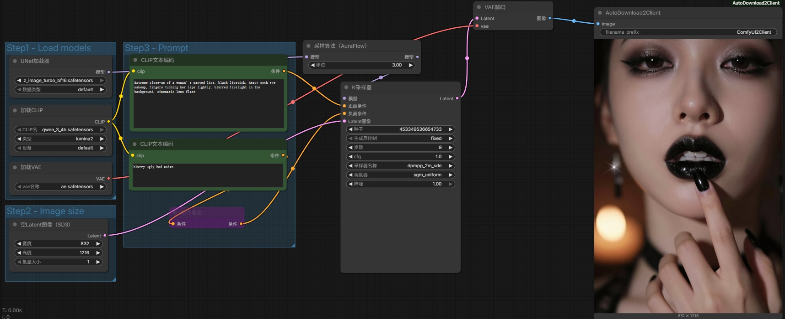

# ComfyUI-AutoDownload2Client

A custom node for ComfyUI that allows you to save generated images directly to your local computer via browser download, ensuring **zero file footprint** on the server's storage.

## Features

- **Direct Local Saving**: Saves images to your client-side machine instead of the server's `output` folder.
- **Privacy & Storage Friendly**: Images are transmitted via memory (Base64), leaving no files on the remote server.
- **In-Node Preview**: Real-time image preview directly on the node despite no server-side files existing.

## Installation

To install this custom node, run the following commands in your terminal:

```bash
cd ComfyUI
git clone https://github.com/iwindy910/ComfyUI-AutoDownload2Client.git
.\python_embeded\python.exe -m pip install -r custom_nodes\ComfyUI-AutoDownload2Client\requirements.txt

## Usage

1. **Browser Configuration**:
   - Go to your browser's **Settings** -> **Downloads**.
   - Set the **Download Location** to your desired path (e.g., `C:\ComfyUI\output\client`).
   - **Disable** "Ask where to save each file before downloading" to enable silent saving.

2. **Workflow**:
   - Search for the `AutoDownload2Client` node.
   - Connect your `IMAGE` output to the node's `image` input.
   - Set your `filename_prefix`.
   - 
